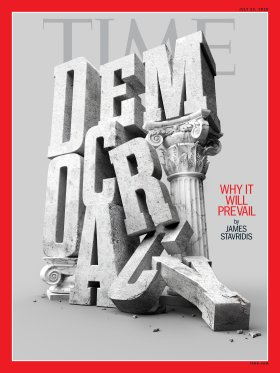

YOLO v3 Time Magazine Covers Detection and Video
=========
This is a demonstration of how to create and train a darknet YOLO v3 model to detect time cover magazines embeded within background images and create a video where time magazine covers are tracked as they move through the video.  Complete instructions are given below.
 
 

 

<b>Image containing Time Magazine covers.</b>

 
 

File | Description
------------ | -------------
examples | Folder containing sample images
README.md | This readme file
create_input_video.py | Creates a copy of project_video.mp4 with Time magazine covers traveling through it
create_output_video.py | Creates outpu_video.mp4 from frames which have Time magazine covers detected and marked by model.
get_images.sh | script which downloads images from http://cvcl.mit.edu/database.htm that are used for training.
get_video_frames.py | Capatures frames from input_video.mp4 and copies them to a folder for darknet model detection.
prepare_images.py | Prepares training images by placing Time magazine covers in them.  Creates label files too.
project_video.mp4 | Video taken from camera mounted on self driving car as it drives down highway.  From Udacity.
time.cfg | Darknet config file for training model.  Defines model architecture, training parameters, etc,
time.data | Darknet file that points to other required files for training.
time.names | List of classes of detectable objects.  In our case, only one class - timecover.
time.weights | Final weights after training.
ytc_utils.py | Utilities supporting other scripts.

## Instructions
The instructions are divided into 4 parts:

1. Installing Darknet (YOLO software)
2. Acquiring & Preparing Training Images
3. Training the Model
4. Creating Example Video

**Prerequisites:**  You must have a unix/linux system with at least one GPU (otherwise training will take days!), Python 3.5 or higher with OpenCV, NumPy, and MoviePy.

### Installing Darknet 

Information on Darknet and YOLO can be found at https://pjreddie.com/darknet/.

This demonstration uses the fork of darknet found at https://github.com/AlexeyAB/darknet because it includes some useful enhancements:
1. Saves the model every 100 iterations
2. Performs detection on an entire folder of images
3. Calculates mAP

Get the darknet project by executing the following:

    >git clone https://github.com/AlexeyAB/darknet.git

Then switch to darknet directory.

    >cd darknet
    
Then edit Makefile and set `CDU=1` (around line ??) so that darknet compiles with CUDA and uses the GPU (otherwise training will take days!!!) and save your changes.

Now compile darknet using the following command:

    >make
    
To make sure everything compiled correctly, execute the following:

    >./darknet
    
you should get the following output.

    >usage: ./darknet <function>
    
For any problems or for more on compiling darknet, see https://pjreddie.com/darknet/install/.

### Acquiring & Preparing Training Images

Now get this project by executing the command:

    >git clone https://github.com/TheOnceAndFutureSmalltalker/yolov3_time_covers.git

Now switch to the yolov3_time_covers folder.  

    >cd yolov3_time_covers

Image prep and video operations will be handled in this directory.  Training and other darknet commands will be executed from the darknet directory.

In the yolov3_time_covers directory you will see some scripts, darknet training files, an examples directory, and a time_covers directory containing images of Time Magazine covers.  These were acquired from http://time.com/vault/year/2018/.  A sample of these are shown below.

 

<table>
    <tr>
        <td></td>
        <td></td>
        <td></td>
        <td></td>
    </tr>    
</table>

 

These are the objects that will be inserted into background images and detected by darknet.

Training images are acquired from http://cvcl.mit.edu/database.htm.  From the yolov3_time_covers directory, run the following shell script to download all of the images and copy them to the images directory.

    >./get_images.sh
    
You should now have an images directory with 1500 or so images.  A few of these are shown below.

 

<table>
    <tr>
        <td></td>
        <td></td>
        <td></td>
        <td></td>
    </tr>    
</table>

 

Now run the following Python script to insert Time magazine covers into these training images.  In addition, frames from the example video, project_video.mp4, are extracted and used as training images as well.

    >python prepare_images.py 

If you inspect some of these images, you will see that most have a Time magazine cover inserted in them somewhere (a few do not).  The sample images from above are shown below with the Time covers inserted.  Yours may appear different as the covers are inserted randomly.

 

<table>
    <tr>
        <td></td>
        <td></td>
        <td></td>
        <td></td>
    </tr>    
</table>

 

Also notice that there is now a labels directory.  For each training image in images directory, there is a corresponding .txt file that indicates the size and location of the Time cover in the image.  Each of these files is just one line long since there is only one Time cover in each image.  An example of the contents of one of these files is shown below.

    0 0.0615234375 0.2638888888888889 0.060546875 0.14583333333333331

Finally, two files, train.txt and val.txt, were created by the script.  These files reference the various images that are used for training or validation respectively.

You are now ready to train the model.

### Training the Model

In order to train the model, you must switch back down to the darknet directory.

    >cd ../
    
There are three different variations for training the model:
1. Using pretrained VOC weights
2. Using no pretrained weights and training from scratch
3. Using the pretrained weights, tiem.weights, provided in this project

For demonstration purposes, we will use the third option.  For more on using the first two options, see https://pjreddie.com/darknet/yolo/

The weights provided in this project, time.weights, are already well trained and sufficient for object detection.  However, we can continue training from this point to try to improve the model even more.  In order to continue training the time.weights, enter the following command:

    >./darknet .........

You will see output that looks like the following.  For each iteration, about every ten sconds or so depending on your hardware, you will see a line like the following.  

What we are looking for as third value, the average loss, to consistently be below 0.06.  Each 100 iterations of training creates a new weights file with updated weights.  These are found in the yolov3_time_covers/backup directory.  You can continue training if you like, however, the remainder of this demonstration will rely on the pre-trained weights provided in the project.  Typically, training takes hours, if not days!  Even with CUDA and GPUs.

In order to test the model, we can run it on some sample images.  In order to do so, execute the following command.

    >./darknet .........
    
This will produce a copy of the test image named, .png, that shows the detected objects.  Look at this image to verify the magazine covers were adequately detected and labeled.

Now we will test our model for mean Average Precision, or mAP.  

### Creating Example Video

This project comes with a 30 second video, project_video.mp4, shot from the dashboard of a car as it drives down the highway.  Go ahead and view this video.

The first thing we will do is create a copy of this video, input_video.mp4, placing Time Magazine covers in the video as if they are traveling down the road with the rest of the traffic.  In order to do this,  execute the following Python script.

    >python create_input_video.py
    
Now view the resulting video, input_video.mp4, to verify the changes were made.  This is what we will use as the input to the darknet detector.  But in order to do this, we must first deconstruct the video into its constituent frames.  In order to do this, execute the following Python script.

    >python get_video_frames.py
    
Now you will see two new directories, frames_in and frames_out.  The frames_in directory contains the video frames and the frames_out is as of yet empty.

Now we will run our trained model on the video frames and put the results in the frames_out directory.  In order to do this, switch to the darknet folder 

    > cd ../

and run the following command.

    >./darknet yolov3_time_covers/time.....

When this command has completed, the frames_out directory will be filled with copies of the frame images with the Time Magazine covers detected and marked.  

Now all that remains is to build another video, output_video.mp4, with the images in frames_out directory.  In order to do this, swithc back to the yolov3_time_covers directory,

    > cd yolov3_time_covers

and execute the following Python script:

    >python create_output_video.py

This will create the final video with the Time Magazine covers detected and labeled as they travel down the road.

