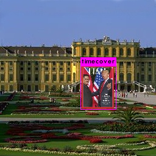

YOLO v3 Time Magazine Covers Detection and Video
=========
This is a demonstration of how to create and train a darknet YOLO v3 model to detect Time Magazine covers embeded within background images and create a video where Time Magazine covers are tracked as they move through the video.  Complete instructions are given below.
<br />
<br />
<p align="center"> </p>
<p align="center"><b>Detected Time Magazine Covers <a href="https://youtu.be/pnOhYnFKPMQ">(watch on YouTube)</a></b></p>
<br />
<br />

File | Description
------------ | -------------
examples | Folder containing sample images
README.md | This readme file
create_input_video.py | Creates a copy of project_video.mp4 with Time magazine covers traveling through it
create_output_video.py | Creates outpu_video.mp4 from frames which have Time magazine covers detected and marked by model.
get_images.sh | Script which downloads images from http://cvcl.mit.edu/database.htm that are used for training.
get_video_frames.py | Captures frames from input_video.mp4 and copies them to a folder for darknet model detection.
prepare_images.py | Prepares training images by placing Time Magazine covers in them.  Creates label files too.
project_video.mp4 | Video taken from camera mounted on self driving car as it drives down highway.  From Udacity.
time_covers | Folder containing images of Time Magazine covers sourced from http://time.com/vault/year/2018/.
time.cfg | Darknet config file for training model.  Defines model architecture, training parameters, etc,
time.data | Darknet file that points to other required files for training.
time.names | List of classes of detectable objects.  In our case, only one class - timecover.
ytc_utils.py | Utilities supporting other scripts.


Instructions
---------
The instructions are divided into 4 sequential parts:

1. Installing Darknet/YOLO Software
2. Acquiring & Preparing Training Images
3. Training & Testing the Model
4. Creating Example Video

**Prerequisites:**  You must have a unix/linux system with at least one GPU (otherwise training will take days!), Python 3.5 or higher with OpenCV and MoviePy installed.

### Installing Darknet 

Information on Darknet and YOLO can be found at https://pjreddie.com/darknet/yolo/.

The standard reference implementation for Darknet/YOLO is found at https://github.com/pjreddie/darknet. This demonstration uses the fork of Darknet found at https://github.com/AlexeyAB/darknet because it includes some useful enhancements:
1. Saves the model every 100 iterations
2. Performs detection on an entire folder of images
3. Calculates mAP

Get the darknet project by executing the following:

    >git clone https://github.com/AlexeyAB/darknet.git

Then switch to `darknet` directory.

    >cd darknet
    
Then edit Makefile and change first line from `GPU=0` to `GPU=1` and save these changes.  This makes sure that darknet compiles with CUDA and uses the GPU (otherwise training will take days!!!).

Now compile darknet using the following command:

    >make
    
To make sure everything compiled correctly, execute the following:

    >./darknet
    
you should get the following output.

    usage: ./darknet <function>
    
For any problems or for more on compiling darknet, see https://pjreddie.com/darknet/install/.


### Acquiring & Preparing Training Images

Now get this project, yolov3_time_covers, by executing the command from `darknet` directory:

    >git clone https://github.com/TheOnceAndFutureSmalltalker/yolov3_time_covers.git

You should now have a `yolov3_time_covers` subdirectory within the `darknet` directory.  Switch to the `yolov3_time_covers` directory.  

    >cd yolov3_time_covers

Image prep and video operations will be handled in the `yolov3_time_covers` directory.  Training and other darknet commands will be executed from the `darknet` directory.

In the `yolov3_time_covers` directory you will see some scripts, darknet training files, an `examples` subdirectory, and a `time_covers` subdirectory containing images of Time Magazine covers.  These Time Magazine covers were acquired from http://time.com/vault/year/2018/.  These are the objects that will be inserted into background images and detected by our model.  A sample of these are shown below.

<br />
<p align="center">
<table>
    <tr>
        <td></td>
        <td></td>
        <td></td>
        <td></td>
    </tr>    
</table>
</p>
<br />


The background images used for training are acquired from http://cvcl.mit.edu/database.htm.  While still in the `yolov3_time_covers` directory, run the following shell script to download all of the images and copy them to the `images` directory.  You may have to give it execution permission first.
   
    >chmod +x get_images.sh
    >./get_images.sh
    
You should now have an `images` directory with 1200 or so images.  A few of these are shown below.

<br />
<p align="center">
<table>
    <tr>
        <td></td>
        <td></td>
        <td></td>
        <td></td>
    </tr>    
</table>
</p>
<br />

Now run the following Python script to insert Time Magazine covers into these training images.  In addition, about 300 frames from the example video, project_video.mp4, are extracted and used as training images as well.  This may take up to 30 seconds or more. 

    >python prepare_images.py 

If you now inspect some of these images, you will see that most have a Time Magazine cover inserted in them somewhere (a few do not).  The sample images from above are shown below with the Time covers inserted.  Yours may appear differently as the covers are sized and placed randomly.

<br />
<p align="center">
<table>
    <tr>
        <td></td>
        <td></td>
        <td></td>
        <td></td>
    </tr>    
</table>
</p>
<br />


Also notice that for each training image in `images` directory, there is a corresponding `.txt` file that indicates the size and location of the Time cover in the image.  Each of these files is just one line long since there is only one Time cover in each image.  An example of the contents of one of these files is shown below.

    0 0.0615234375 0.2638888888888889 0.060546875 0.14583333333333331

Finally, two files, `train.txt` and `val.txt`, were created by the script.  These files reference the various images that are used for training and validation respectively.

You are now ready to train the model.

### Training the Model

In order to train the model, you must switch back to the `darknet` directory.

    >cd ../
    
Now enter the following command to start the training process.

    >./darknet detector train yolov3_time_covers/time.data yolov3_time_covers/time.cfg

You will see output that looks like the following.  
```
Region 94 Avg IOU: 0.397011, Class: 0.278333, Obj: 0.541654, No Obj: 0.478844, .5R: 0.333333, .75R: 0.000000,  count: 3
Region 106 Avg IOU: -nan, Class: -nan, Obj: -nan, No Obj: 0.495184, .5R: -nan, .75R: -nan,  count: 0
Region 82 Avg IOU: -nan, Class: -nan, Obj: -nan, No Obj: 0.510051, .5R: -nan, .75R: -nan,  count: 0
Region 94 Avg IOU: 0.300388, Class: 0.589520, Obj: 0.411171, No Obj: 0.476367, .5R: 0.000000, .75R: 0.000000,  count: 3
Region 106 Avg IOU: 0.142791, Class: 0.579211, Obj: 0.353023, No Obj: 0.495448, .5R: 0.000000, .75R: 0.000000,  count: 1
Region 82 Avg IOU: -nan, Class: -nan, Obj: -nan, No Obj: 0.513282, .5R: -nan, .75R: -nan,  count: 0
Region 94 Avg IOU: 0.193806, Class: 0.441971, Obj: 0.286082, No Obj: 0.475946, .5R: 0.000000, .75R: 0.000000,  count: 3
Region 106 Avg IOU: 0.043656, Class: 0.243478, Obj: 0.594254, No Obj: 0.493858, .5R: 0.000000, .75R: 0.000000,  count: 1
Region 82 Avg IOU: -nan, Class: -nan, Obj: -nan, No Obj: 0.511844, .5R: -nan, .75R: -nan,  count: 0
Region 94 Avg IOU: 0.207007, Class: 0.495040, Obj: 0.078412, No Obj: 0.476503, .5R: 0.000000, .75R: 0.000000,  count: 2
Region 106 Avg IOU: 0.197296, Class: 0.465678, Obj: 0.383829, No Obj: 0.494798, .5R: 0.000000, .75R: 0.000000,  count: 1
```
Each line indicates current level of success for detecting objects in the image.  For each iteration, about every ten seconds or so depending on your hardware, you will see an iteration summary like the following for iteration 3:  

```3: 910.298218, 910.967896 avg loss, 0.000000 rate, 9.746541 seconds, 192 images```

An iteration is defined in the `time.cfg` file as a batch of 64 images.  What you are looking for is the avg loss number, currently 910.967896 in the example above, to go down. A good rule of thumb is that training can be stopped when the average loss is consistently below 0.06.

Each 100 iterations of training creates a new weights file with updated weights.  These are found in the `yolov3_time_covers/backup` directory.  You can stop training any time and resume with the most recent weights file.  Typically, training takes hours, if not days!  Even with CUDA and GPUs!  For more on training darknet models, see https://pjreddie.com/darknet/yolo/.

Once we have completed training the model, we can test it on some sample images.  We will use the most recent weights file saved in the backup subdirectory.  Execute the command below.

    >./darknet detector test yolov3_time_covers/time.data yolov3_time_covers/time.cfg yolov3_time_covers/backup/time_last.weights yolov3_time_covers/images/a223049.jpg
    
This will produce a copy of the test image that shows the detected objects.  This copy is saved as `predictions.png`.  Look at this image to verify the magazine covers were adequately detected and labeled.  The resulting image for the command above is shown below.

<br />
<br />
<p align="center"> </p>
<p align="center"><b>Detected Time magazine Cover.</b></p>
<br />
<br />

Another way to test the model is to calculate mean Average Precision, mAP, on the validation data set.  To do this, execute the following command.

    >./darknet detector map yolov3_time_covers/time.data yolov3_time_covers/time.cfg yolov3_time_covers/backup/time_last.weights 

You should get output such as the following.

```
calculation mAP (mean average precision)...
172
 detections_count = 152, unique_truth_count = 128
class_id = 0, name = timecover,          ap = 100.00 %
 for thresh = 0.25, precision = 1.00, recall = 1.00, F1-score = 1.00
 for thresh = 0.25, TP = 128, FP = 0, FN = 0, average IoU = 90.15 %

 mean average precision (mAP) = 1.000000, or 100.00 %
Total Detection Time: 7.000000 Seconds
```

In the example above, we found all of the Time Magazine covers, had no false positives, and had an average IoU of 90.15%.


### Creating Example Video

This project comes with a 30 second video, project_video.mp4, shot from the dashboard of a car as it drives down the highway.  Go ahead and view this videov ([project_video.mp4 on YouTube](https://youtu.be/_VHY2apFHvU)). Some of the frames from this video were used in the training process above.

The first thing we will do is create a copy of this video, `input_video.mp4`, placing Time Magazine covers in the video as if they are traveling down the road with the rest of the traffic.  In order to do this, switch back to the `yolov3_time_covers` directory,

    >cd yolov3_time_covers

and execute the following Python script.

    >python create_input_video.py
    
Now view the resulting video, `input_video.mp4`, to verify the changes were made ([input_video.mp4 on YouTube](https://youtu.be/mAJolAgUF9o)).  This is what we will use as the input to the darknet detector.  But in order to do this, we must first deconstruct the video into its constituent frames.  To do this, execute the following Python script.

    >python get_video_frames.py
    
Now you will see two new directories, `frames_in` and `frames_out`.  The `frames_in` directory contains the video frames and the `frames_out` is as of yet empty.

Now we will run our trained model on the video frames and put the results in the `frames_out` directory.  In order to do this, temporarily switch back to the `darknet` folder. 

    >cd ../

Now execute the command to get a newer version of one of the darknet files `detector.c`.

    >wget https://github.com/pjreddie/darknet/files/2674089/detector.c.zip

Unzip this file and copy it to the `src` directory, replacing the current version.

    >unzip detector.c.zip
    >cp detecctor.c src/.

Now rebuild darknet.

    >make    

Now we are ready to run detection on all of our video frames.  Execute the following darknet command.

    > ./darknet detector test yolov3_time_covers/time.data yolov3_time_covers/time.cfg yolov3_time_covers/backup/time_last.weights batch yolov3_time_covers/frames_in/ yolov3_time_covers/frames_out/ >./results.txt

This may take several minutes to complete.  When this command has completed, the `frames_out` directory will be filled with copies of the video frame images with the Time Magazine covers detected and marked.  If you look at the contents fo `frames_out` you will notice that the files end with `.jpg.png` extension.  This is a minor flaw with the new `detetor.c` file.  The image files are in fact png format and will work just fine as is.  No renaming is necessary.  

Now all that remains is to build another video, `output_video.mp4`, with the images in `frames_out` directory.  In order to do this, switch back to the `yolov3_time_covers` directory.

    > cd yolov3_time_covers

and execute the following Python script:

    >python create_output_video.py

This will create the final video, `output_video.mp4`, with the Time Magazine covers detected and labeled as they travel down the road.  View this video to make sure the detections are accurate ([output_video.mp4 on YouTube](https://youtu.be/pnOhYnFKPMQ)).

Additional Thoughts
-------
The scope of the exercise was purposefully kept narrow to minimize feature prep time and training time.  

* There is only one class, timecover.  Normally there are many classes - dog, cat, person, car, etc.  More classes require more training time.

* Very few training images are required in order to achieve adequate precision.  Some training image sets are over a hundred thousand.  Processing more images simply requires more training time (not always though).

* A significant portion of the training images were drawn from the target video, making the model rather specific to the task.  Since the model did not have to generalize as much, training time was reduced.

* There was not enough variety in the background images.  A wider set of background images would cause the model to converge more slowly.

* Except for size, the Time Cover images were not modified in any realistic and general way.  A more realistic/general approach would include image modifications such as rotation, occlusion/overlap, perspective transformation, and obscuring with fog/mist.  

Relaxing the narrow conditions above would create a much more robust and general model; however, it would come at the additional cost of increased data prep time and a greatly increased training time.


